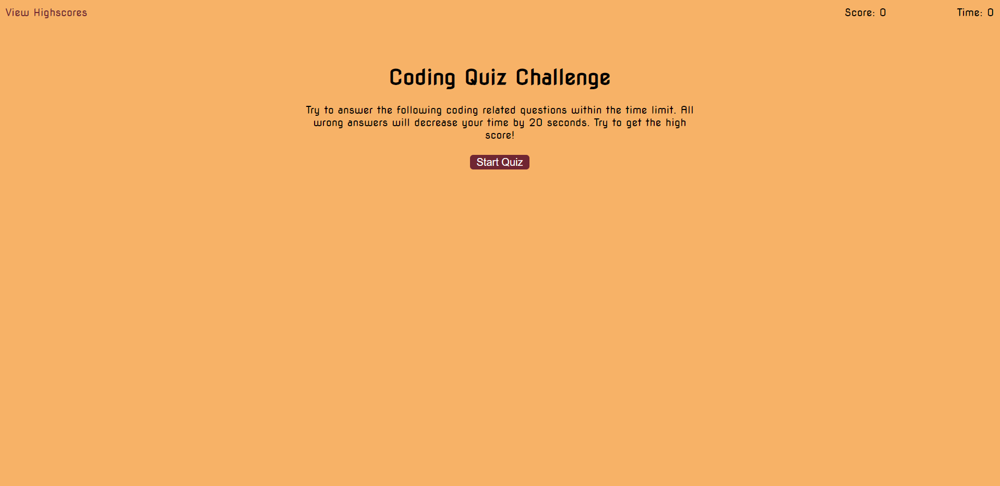
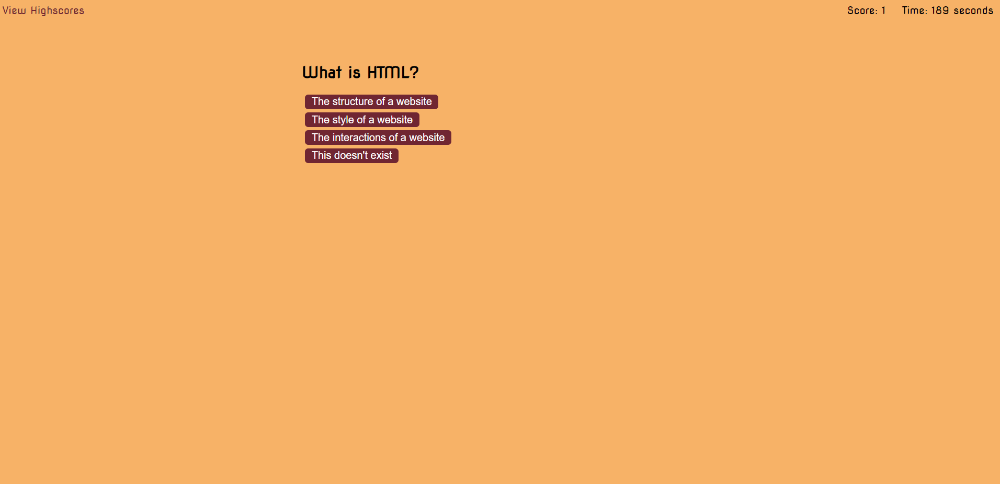
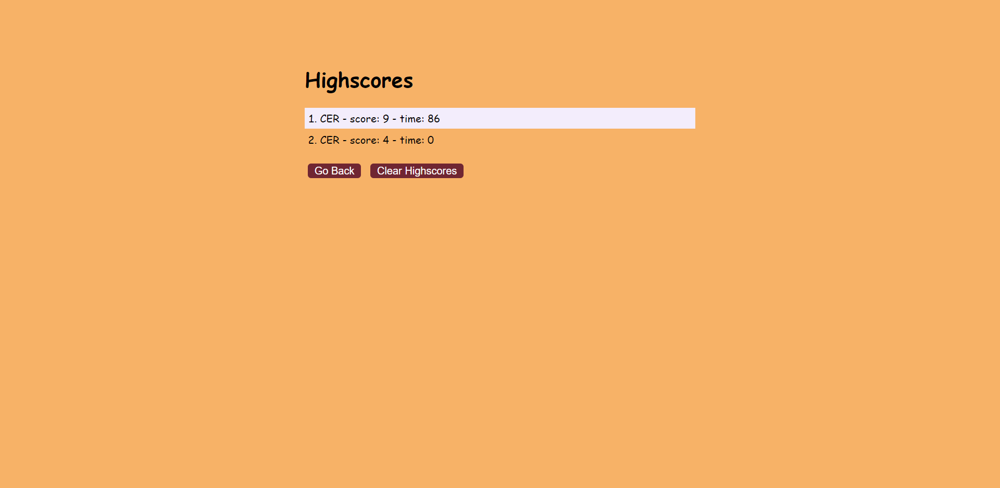

# Javascript Coding Quiz

The coding quiz is a short quiz to test your knowledge about the basics of coding. This covers HTML, CSS, and Javascript basics. Not too much knowledge is needed to pass this quiz. 

<a href = 
"https://chrisrisseler.github.io/javascript-coding-quiz/">Here is a link to the quiz</a>

## Using Javascript Coding Quiz

To use the coding quiz, you just have to click start quiz. If you click high score, you will go to the page with the high scores on it, where you can enter your own high score. The timer will start at 70 seconds and will count down, but if you get a question wrong, you will lose 20 seconds of your time.

  

## Contributors

Thanks to the following people who have contributed to this project:

* Chris R.
* Alper G.
* Carl V.
* Joshua B.
* Tim A.

## Contact

If you want to contact me you can reach me at chrisrisseler43@gmail.com.

## License
<!--- If you're not sure which open license to use see https://choosealicense.com/--->

This project uses the following license: MIT Liscence Copywright (c) 2020 Chris Risseler <a href = "assets/license.md">License Here.</a>